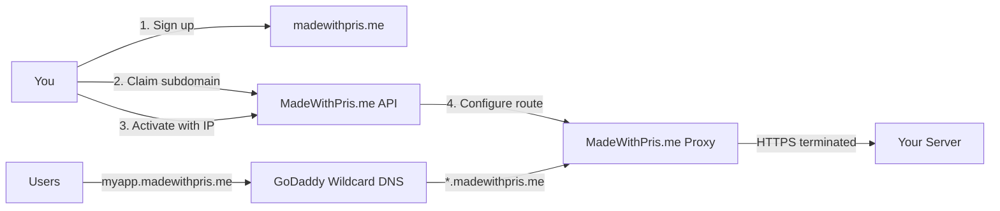

# MadeWithPris.me

**Managed subdomain service for Prism projects.**

Get a production-ready subdomain at `https://yourapp.madewithpris.me` in minutes.

## What is MadeWithPris.me?

MadeWithPris.me provides managed `*.madewithpris.me` subdomains with automatic HTTPS for Prism projects. Sign up, claim a subdomain, and we handle the rest—wildcard DNS and SSL are already configured.

## Key Features

- **Quick Setup**: Get `https://myapp.madewithpris.me` in under 5 minutes
- **Wildcard DNS**: All `*.madewithpris.me` subdomains route through our proxy
- **Automatic HTTPS**: Wildcard SSL certificate handles all subdomains
- **CLI Integration**: Seamless `prism subdomain` commands

## How It Works



1. **Sign up** at madewithpris.me and get your API key
2. **Claim** a subdomain: `prism subdomain claim myapp`
3. **Activate** with your server IP: `prism subdomain activate myapp --ip 1.2.3.4`
4. Our **proxy** routes `myapp.madewithpris.me` to your server with HTTPS

### Architecture

- **Wildcard DNS**: `*.madewithpris.me` points to our proxy (GoDaddy)
- **Wildcard SSL**: Single certificate covers all subdomains
- **Reverse Proxy**: Terminates HTTPS, forwards requests to your server IP
- **Your Server**: Receives plain HTTP traffic from our proxy

## Quick Start

```bash
# Login with your API key
prism auth login

# Claim a subdomain
prism subdomain claim myapp

# Activate with your server's IP
prism subdomain activate myapp --ip 1.2.3.4

# Your app is now live at https://myapp.madewithpris.me!
```

## Documentation

- [Getting Started](getting-started/index.md) - Set up your first subdomain
- [API Reference](api/index.md) - REST API documentation
- [CLI Reference](cli/index.md) - Command-line interface
