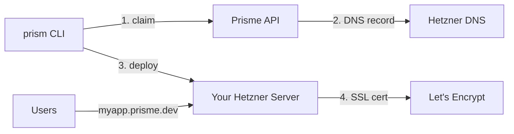

# Prisme.dev

**Managed subdomain service for Prism projects.**

Get a production-ready subdomain at `https://yourapp.prisme.dev` in minutes.

## What is Prisme.dev?

Prisme.dev provides managed `*.prisme.dev` subdomains with automatic HTTPS for Prism projects deployed to Hetzner. This is **not** managed hosting—you bring your own Hetzner server, and Prisme provides DNS + SSL convenience.

## Key Features

- **Quick Setup**: Spin up `https://myapp.prisme.dev` in under 5 minutes
- **Automatic DNS**: We manage the DNS A records pointing to your server
- **Let's Encrypt SSL**: Your Traefik instance handles certificate provisioning
- **CLI Integration**: Seamless `prism subdomain` commands

## How It Works



1. **Claim** a subdomain with `prism subdomain claim myapp`
2. **Activate** with your server IP: `prism subdomain activate myapp --ip 1.2.3.4`
3. **Deploy** your Prism app to your Hetzner server
4. Your **Traefik** instance automatically provisions SSL certificates

## Quick Start

```bash
# Login with your API key
prism auth login

# Claim a subdomain
prism subdomain claim myapp

# Deploy and activate
prism deploy apply
prism subdomain activate myapp --ip $(prism deploy ip)

# Your app is now live at https://myapp.prisme.dev!
```

## Documentation

- [Getting Started](getting-started/index.md) - Set up your first subdomain
- [API Reference](api/index.md) - REST API documentation
- [CLI Reference](cli/index.md) - Command-line interface
